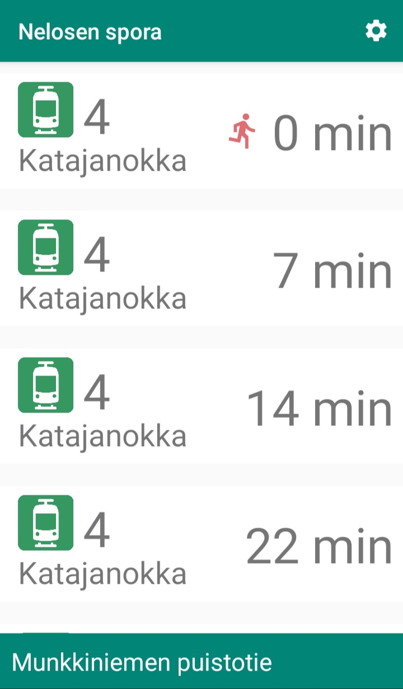
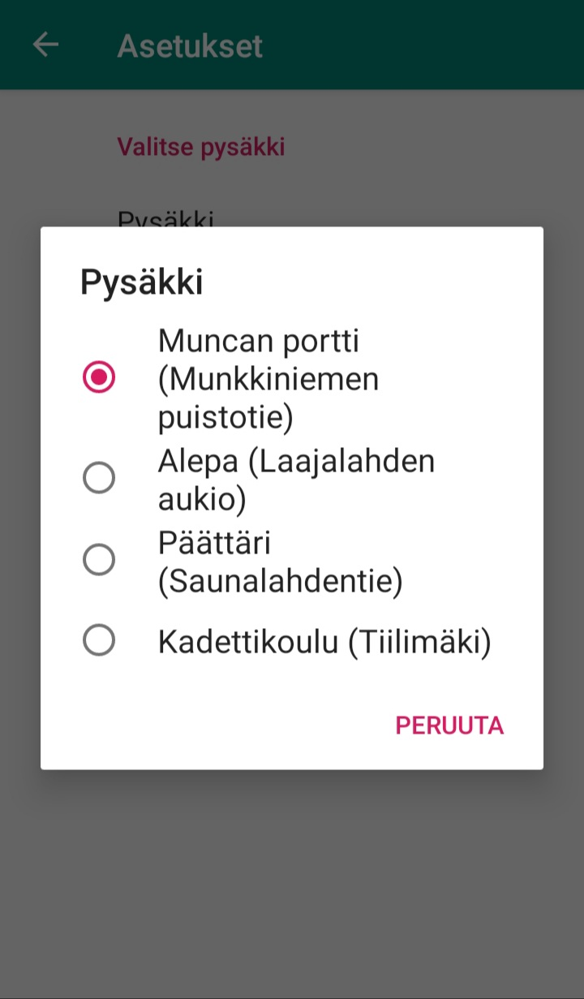

# Tram 4 - The App : Nelosen spora Pro

Simple but super handy Android application for showing the departure times of tram 4 at Munkkiniemi, Helsinki. App fetches data from a [service](https://github.com/pimpbot9000/4-ratikka-service/) hosted at [Heroku](https://tram-4-service.herokuapp.com/api/alepa).

Refreshing the data is impelemted in a very crude way, the app just polls the API at a fixed intervall. Maybe if I find the time I'll put some effort into it like but at the moment I'm the only person in this universe using the app it'll do.

A couple of screenshots, for your viewing pleasure:

### Note

The latest "Pro" version has animations and even that cool red symbol of a running dude which blinks when it's time to run if you wanna catch the next train. Not applicable if you're already at the stop. Also added a missing stop which somebody pointed out.

