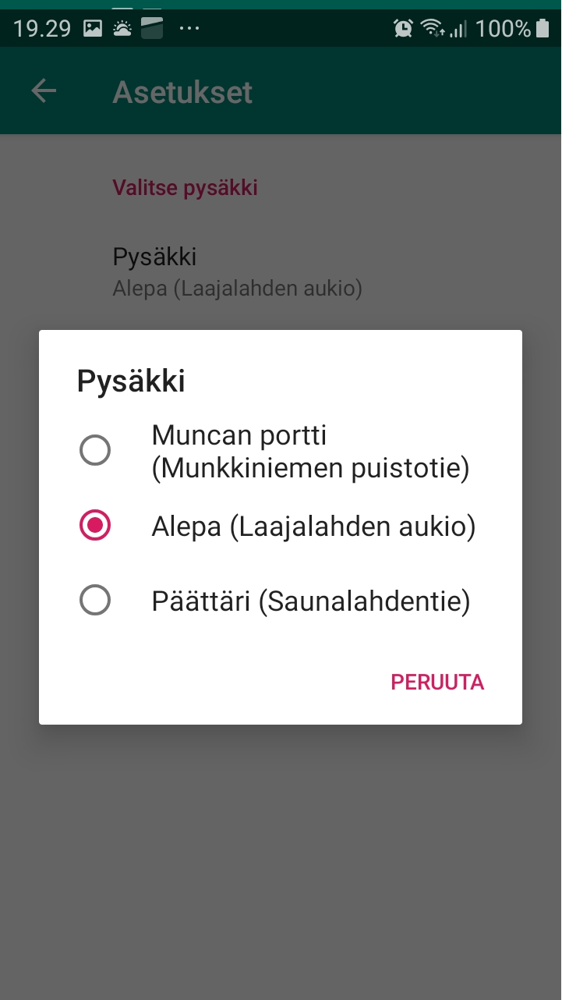

# Tram 4 - The App : Nelosen spora - the apsi

Android application for showing the departure times of tram 4 at Munkkiniemi, Helsinki. App fetches data from a [service](https://github.com/pimpbot9000/4-ratikka-service/) hosted at [Heroku](https://tram-4-service.herokuapp.com/api/alepa).

A couple of screenshots, for your viewing pleasure:

